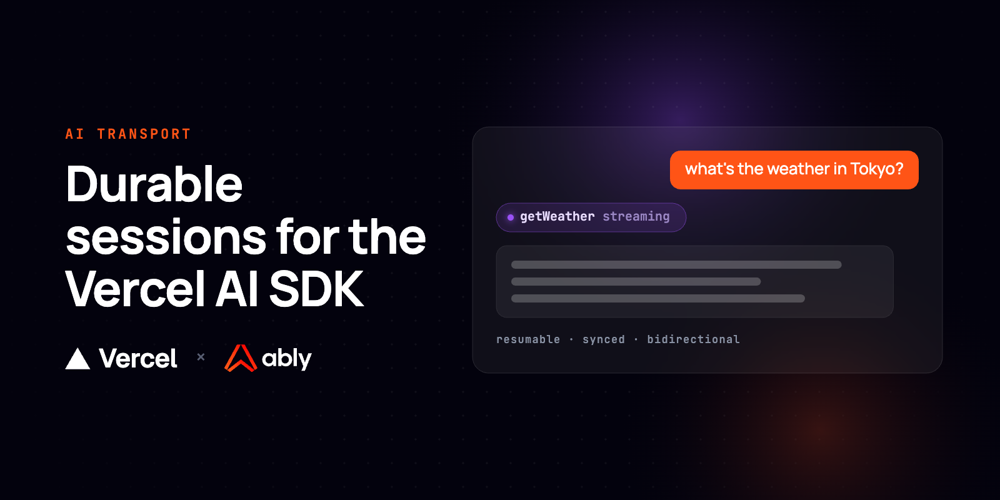
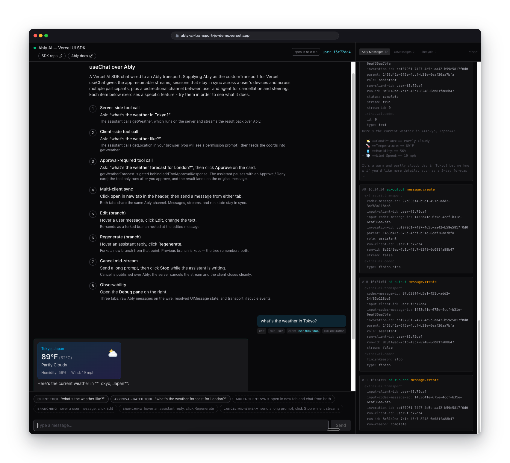
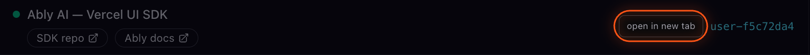

# Ably Chat Transport for the Vercel AI SDK



A Next.js AI chat app that plugs [Ably AI Transport](https://ably.com/docs/ai-transport) into the [Vercel AI SDK](https://ai-sdk.dev)'s [`useChat`](https://ai-sdk.dev/docs/reference/ai-sdk-ui/use-chat) hook. The model's response streams over an Ably session instead of a single HTTP response, so it survives reconnects, follows the user across devices and tabs, and can be stopped from any of them.

It demonstrates server-side tools, client-side tools (browser geolocation), approval-gated tools, multi-client and multi-user sync, live presence avatars of everyone on the channel, edit/regenerate branching, mid-stream cancellation, an agent task checklist backed by Ably LiveObjects on the same channel, and a live debug pane showing the raw Ably messages.



## How it works

Ably AI Transport is a [durable session layer](https://ably.com/docs/ai-transport/why) for AI apps. Model tokens stream over an Ably session rather than one HTTP request, so a conversation outlives the connection that started it. This enables:

- **Resumable streaming.** Tokens publish to an Ably channel, so a client that reconnects rejoins the live stream and recovers anything it missed.
- **Cross-device and multi-tab continuity.** The session is open to every client on the channel, so the same conversation stays in sync across every surface at once.
- **Shared control.** Any participant can publish to the session, so a Stop button on one device cancels a turn that began on another.
- **Tools and human-in-the-loop.** Server tools, browser tools, and approval-gated tools run through the same session, alongside edit and regenerate branching.
- **Shared state.** For multi-step requests the agent keeps a live checklist in [Ably LiveObjects](https://ably.com/docs/ai-transport/features/liveobjects) on the same channel, writing it through the `updateChecklist` tool. 

In this app the user sends a chat prompt from the browser, the `/api/chat` route runs the model with the AI SDK's `streamText`, and transport pipes the response back over Ably. The client receives it through the AI Transport SDK's `useChat` transport.

Each fresh browser visit opens a new channel; append `?channel=<name>` to pin a specific one, or click **open in new tab** in the header to join the same channel as a second client.



The right-hand window shows the messages being sent over the Ably channel. This is additional information to help you understand how the transport is working. You can find full details of the protocol in the [Ably AI Transport docs](https://ably.com/docs/ai-transport).

## How to use

### Requirements

- A free [Ably API key](https://ably.com/accounts)
- The _Message annotations, updates, deletes, and appends_ channel rule enabled on your namespace (see [the Ably docs](https://ably.com/docs/ai-transport/getting-started/channel-rules))
- One AI provider key: Anthropic, OpenAI, or a Vercel AI Gateway key

### One-click deploy

Deploy with [Vercel](https://vercel.com). You'll be prompted for `ABLY_API_KEY` and `ANTHROPIC_API_KEY`:

[](https://vercel.com/new/clone?repository-url=https://github.com/ably/ably-vercel-ai-chattransport&project-name=ably-vercel-ai-chattransport&repository-name=ably-vercel-ai-chattransport&env=ABLY_API_KEY,ANTHROPIC_API_KEY)

### Run locally

#### Prerequisites

- Node.js >= 22

#### Setup

```bash
# Install dependencies
npm install

# Configure environment
cp .env.example .env.local
# then set ABLY_API_KEY + one AI provider key

# Run the dev server
npm run dev
```

Open <http://localhost:3000>. 

## Authentication

The server signs a short-lived JWT for the client from the `ABLY_API_KEY`. The token is scoped to the connecting client's `clientId` and to the channel namespace (`<namespace>*`, default `ai:*`). 

The key reaches the server only through the `ABLY_API_KEY` environment variable. Set it in `.env.local` locally, or through the Vercel deploy prompt (`&env=ABLY_API_KEY` on the deploy URL). 

## Environment variables

| Variable           | Required | Description                                                                 |
| ------------------ | -------- | --------------------------------------------------------------------------- |
| `ABLY_API_KEY`     | Yes      | [Ably API key](https://ably.com/accounts). Used server-side to sign client JWTs and publish messages. |
| `ANTHROPIC_API_KEY`| One of   | Anthropic key. Provider priority: Anthropic > AI Gateway > OpenAI.          |
| `AI_GATEWAY_API_KEY` | One of | Vercel AI Gateway key.                                                      |
| `OPENAI_API_KEY`   | One of   | OpenAI (or OpenAI-compatible) key.                                          |
| `NEXT_PUBLIC_ABLY_CHANNEL_NAMESPACE` | No | Channel namespace for AI Transport sessions (default `ai:`). The namespace must have a [channel rule](https://ably.com/docs/ai-transport/getting-started/channel-rules) with "Message annotations, updates, deletes, and appends" enabled. |

Model name and endpoint overrides (`ANTHROPIC_MODEL`, `AI_GATEWAY_MODEL`, `OPENAI_MODEL`, `OPENAI_BASE_URL`) are optional. See [`.env.example`](./.env.example) for the full list and defaults.

## Contributing

Want to help contributing to this project? Have a look at our [contributing guide](CONTRIBUTING.md)!

## Learn more

- [Ably AI Transport docs](https://ably.com/docs/ai-transport)
- [Ably AI Transport SDK](https://github.com/ably/ably-ai-transport-js)
- [Vercel AI SDK docs](https://ai-sdk.dev)
